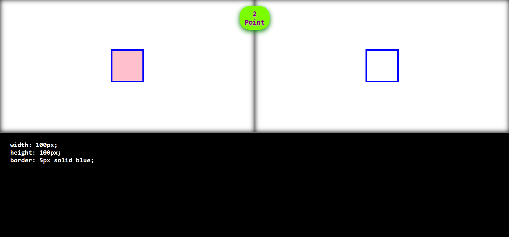

Write if you manage

Preview: 
This is a This is a training game for practicing the most basic CSS knowledge. Below is a "CSS Code Editor." Enter styles there to create the object shown in the left field. The result of your code will appear in the right field. If they match, you'll advance to the next level. There are six levels in total. It's recommended to write the code correctly and semantically to avoid bugs. Also, when specifying colors, use only words. Don't use encoding or RGB. Even if the colors match, if they aren't specified using words, you won't score points and won't complete the level until you specify the color using words. There may also be a style where you need to move the cursor over it. Why? You'll find out as you play through the game 😉

I used HTML + CSS + JS for this game. 

https://tickygeo.github.io/write-if-you-manage/
